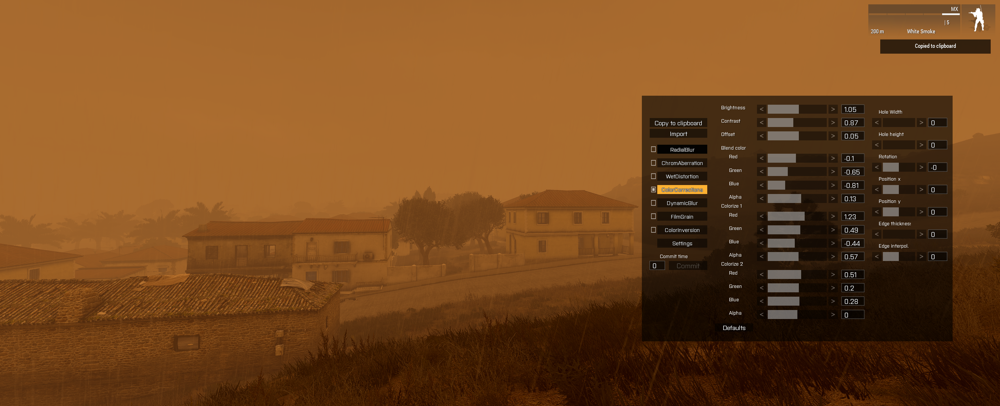

## No Name


```
PP_colorC = ppEffectCreate ["ColorCorrections",1500];
PP_colorC ppEffectEnable true;
PP_colorC ppEffectAdjust [0.78,1,0,[0.14,1.16,0.26,0.04],[0.34,0.89,1.03,1.22],[-0.63,1.73,0.33,0],[0.23,0,0,0,0,0,4]];
PP_colorC ppEffectCommit 0;
PP_film = ppEffectCreate ["FilmGrain",2000];
PP_film ppEffectEnable true;
PP_film ppEffectAdjust [0.67,1.5,1.59,0.56,0.69,true];
PP_film ppEffectCommit 0;
// Date YYYY-MM-DD-HH-MM: [2035,6,24,8,0]. Overcast: 0.695298. Fog: 0.522613. Fog params: [0.522613,0.015,100] 
// GF PostProcess Editor parameters: Copy the following line to clipboard and click Import in the editor.
//[[false,100,[0.01,0.15,0.22,0.24]],[false,200,[0.43,0.27,true]],[false,300,[3.03,0.09,0.54,0.33,0.67,2.25,2.42,-0.05,0.14,0.04,0.01,0.04,0.1,0.2,0.2]],[true,1500,[0.78,1,0,[0.14,1.16,0.26,0.04],[0.34,0.89,1.03,1.22],[-0.63,1.73,0.33,0],[0.23,0,0,0,0,0,4]]],[false,500,[1]],[true,2000,[0.67,1.5,1.59,0.56,0.69,true]],[false,2500,[1,1,1]]]
```
## No Name


```
PP_chrom = ppEffectCreate ["ChromAberration",200];
PP_chrom ppEffectEnable true;
PP_chrom ppEffectAdjust [0,0,true];
PP_chrom ppEffectCommit 0;
PP_colorC = ppEffectCreate ["ColorCorrections",1500];
PP_colorC ppEffectEnable true;
PP_colorC ppEffectAdjust [0.98,0.93,0.08,[-0.37,-0.49,-0.26,0.16],[1.08,0.49,-0.34,0.57],[0.33,0.33,0.33,0],[0,0,0,0,0,0,4]];
PP_colorC ppEffectCommit 0;
PP_film = ppEffectCreate ["FilmGrain",2000];
PP_film ppEffectEnable true;
PP_film ppEffectAdjust [0.16,1.72,2.5,0.38,1.3,true];
PP_film ppEffectCommit 0;
// Date YYYY-MM-DD-HH-MM: [2035,6,24,8,0]. Overcast: 0.3. Fog: 0.415196. Fog params: [0.415196,0.013,0] 
// GF PostProcess Editor parameters: Copy the following line to clipboard and click Import in the editor.
//[[false,100,[0.07,0.07,0.15,0.12]],[true,200,[0,0,true]],[false,300,[1,0.2,0.2,1,1,1,1,0.05,0.01,0.05,0.01,0.1,0.1,0.2,0.2]],[true,1500,[0.98,0.93,0.08,[-0.37,-0.49,-0.26,0.16],[1.08,0.49,-0.34,0.57],[0.33,0.33,0.33,0],[0,0,0,0,0,0,4]]],[false,500,[1]],[true,2000,[0.16,1.72,2.5,0.38,1.3,true]],[false,2500,[0.8,0.67,0]]] 
```


## No Name


```
PP_chrom = ppEffectCreate ["ChromAberration",200];
PP_chrom ppEffectEnable true;
PP_chrom ppEffectAdjust [0,0,true];
PP_chrom ppEffectCommit 0;
PP_colorC = ppEffectCreate ["ColorCorrections",1500];
PP_colorC ppEffectEnable true;
PP_colorC ppEffectAdjust [0.98,0.93,0.08,[-0.28,-0.28,-0.04,0.11],[1.23,0.44,-0.54,0.57],[0.33,0.33,0.33,0],[0,0,0,0,0,0,4]];
PP_colorC ppEffectCommit 0;
PP_film = ppEffectCreate ["FilmGrain",2000];
PP_film ppEffectEnable true;
PP_film ppEffectAdjust [0.16,1.72,2.5,0.38,1.3,true];
PP_film ppEffectCommit 0;
// Date YYYY-MM-DD-HH-MM: [2035,6,24,8,0]. Overcast: 0.01. Fog: 0.419155. Fog params: [0.415196,0.013,0] 
// GF PostProcess Editor parameters: Copy the following line to clipboard and click Import in the editor.
//[[false,100,[0.07,0.07,0.15,0.12]],[true,200,[0,0,true]],[false,300,[1,0.2,0.2,1,1,1,1,0.05,0.01,0.05,0.01,0.1,0.1,0.2,0.2]],[true,1500,[0.98,0.93,0.08,[-0.28,-0.28,-0.04,0.11],[1.23,0.44,-0.54,0.57],[0.33,0.33,0.33,0],[0,0,0,0,0,0,4]]],[false,500,[1]],[true,2000,[0.16,1.72,2.5,0.38,1.3,true]],[false,2500,[0.8,0.67,0]]]
```
## No Name


```
PP_colorC = ppEffectCreate ["ColorCorrections",1500];
PP_colorC ppEffectEnable true;
PP_colorC ppEffectAdjust [0.98,0.93,0.08,[-0.1,-0.51,-0.71,0.17],[1.23,0.44,-0.54,0.77],[0.33,0.33,0.33,0],[0,0,0,0,0,0,4]];
PP_colorC ppEffectCommit 0;
// Date YYYY-MM-DD-HH-MM: [2035,6,24,8,0]. Overcast: 0.01. Fog: 0.419668. Fog params: [0.415196,0.013,0] 
// GF PostProcess Editor parameters: Copy the following line to clipboard and click Import in the editor.
//[[false,100,[0.07,0.07,0.15,0.12]],[false,200,[0,0,true]],[false,300,[1,0.2,0.2,1,1,1,1,0.05,0.01,0.05,0.01,0.1,0.1,0.2,0.2]],[true,1500,[0.98,0.93,0.08,[-0.1,-0.51,-0.71,0.17],[1.23,0.44,-0.54,0.77],[0.33,0.33,0.33,0],[0,0,0,0,0,0,4]]],[false,500,[1]],[false,2000,[0.16,1.72,2.5,0.38,1.3,true]],[false,2500,[0.8,0.67,0]]]
```


## No Name

```
PP_colorC = ppEffectCreate ["ColorCorrections",1500];
PP_colorC ppEffectEnable true;
PP_colorC ppEffectAdjust [0.84,1,0.08,[-0.1,-0.51,-0.73,0.21],[1.23,0.44,-0.54,0.77],[0.33,0.33,0.33,0],[0,0,0,0,0,0,4]];
PP_colorC ppEffectCommit 0;
// Date YYYY-MM-DD-HH-MM: [2035,6,24,8,0]. Overcast: 0.0134349. Fog: 0.424803. Fog params: [0.415196,0.013,0] 
// GF PostProcess Editor parameters: Copy the following line to clipboard and click Import in the editor.
//[[false,100,[0.07,0.07,0.15,0.12]],[false,200,[0,0,true]],[false,300,[1,0.2,0.2,1,1,1,1,0.05,0.01,0.05,0.01,0.1,0.1,0.2,0.2]],[true,1500,[0.84,1,0.08,[-0.1,-0.51,-0.73,0.21],[1.23,0.44,-0.54,0.77],[0.33,0.33,0.33,0],[0,0,0,0,0,0,4]]],[false,500,[1]],[false,2000,[0.16,1.72,2.5,0.38,1.3,true]],[false,2500,[0.8,0.67,0]]]
```

## No Name

```
PP_colorC = ppEffectCreate ["ColorCorrections",1500];
PP_colorC ppEffectEnable true;
PP_colorC ppEffectAdjust [0.84,1,0.08,[-0.1,-0.51,-0.73,0.21],[1.23,0.44,-0.54,0.77],[0.33,0.33,0.33,0],[0,0,0,0,0,0,4]];
PP_colorC ppEffectCommit 0;
// Date YYYY-MM-DD-HH-MM: [2035,6,24,8,0]. Overcast: 0.0139816. Fog: 0.1834. Fog params: [0.1834,0.01,200] 
// GF PostProcess Editor parameters: Copy the following line to clipboard and click Import in the editor.
//[[false,100,[0.07,0.07,0.15,0.12]],[false,200,[0,0,true]],[false,300,[1,0.2,0.2,1,1,1,1,0.05,0.01,0.05,0.01,0.1,0.1,0.2,0.2]],[true,1500,[0.84,1,0.08,[-0.1,-0.51,-0.73,0.21],[1.23,0.44,-0.54,0.77],[0.33,0.33,0.33,0],[0,0,0,0,0,0,4]]],[false,500,[1]],[false,2000,[0.16,1.72,2.5,0.38,1.3,true]],[false,2500,[0.8,0.67,0]]]
```

## No Name

```
PP_colorC = ppEffectCreate ["ColorCorrections",1500];
PP_colorC ppEffectEnable true;
PP_colorC ppEffectAdjust [1.05,0.87,0.05,[-0.1,-0.65,-0.81,0.13],[1.23,0.49,-0.44,0.57],[0.51,0.2,0.28,0],[0,0,-0,0,0,0,0]];
PP_colorC ppEffectCommit 0;
// Date YYYY-MM-DD-HH-MM: [2035,6,24,7,51]. Overcast: 0.907985. Fog: 0.206015. Fog params: [0.206015,0.01,200] 
// GF PostProcess Editor parameters: Copy the following line to clipboard and click Import in the editor.
//[[false,100,[0.07,0.07,0.15,0.12]],[false,200,[0,0,true]],[false,300,[1,0.2,0.2,1,1,1,1,0.05,0.01,0.05,0.01,0.1,0.1,0.2,0.2]],[true,1500,[1.05,0.87,0.05,[-0.1,-0.65,-0.81,0.13],[1.23,0.49,-0.44,0.57],[0.51,0.2,0.28,0],[0,0,-0,0,0,0,0]]],[false,500,[1]],[false,2000,[0.16,1.72,2.5,0.38,1.3,true]],[false,2500,[0.8,0.67,0]]]
```